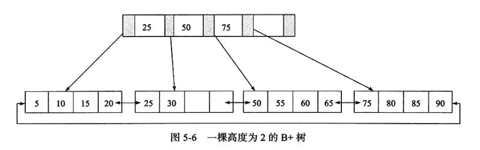
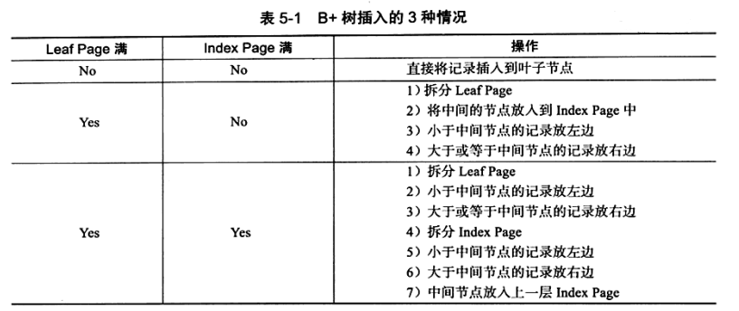
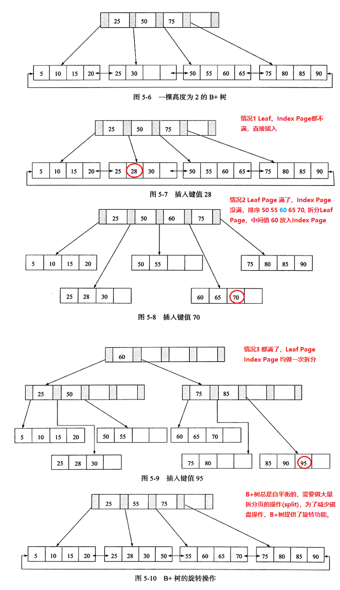
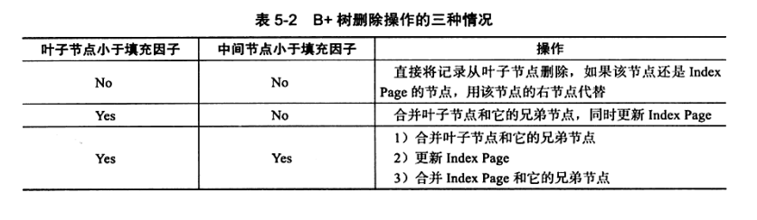
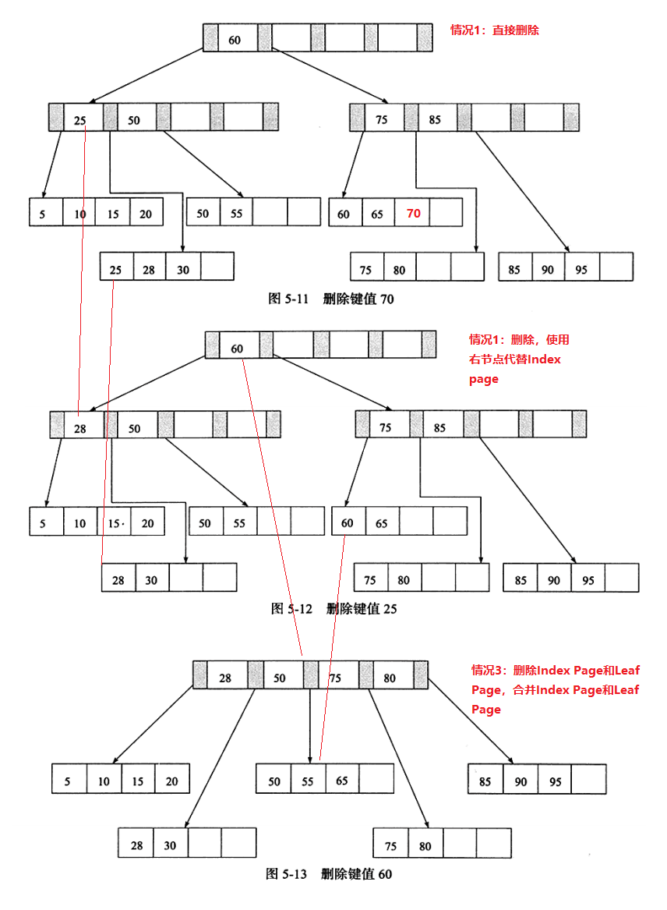

# InnoDB - 索引与算法

## 1、索引概述

**支持常见索引：**

* B+ 树索引
* 全文索引
* 哈希索引

*PS: B+树中的B不是代表二叉(binary), 而是代表平衡(balance), 因为B+ 树是从最早的平衡二叉树演变而来， 但是B+ 树不是一个二叉树。*

***

## 2、数据结构与算法

### 2.1  二分查找

* 又叫折半查找法；
* InnoDB引擎的表中，每页Page Directory 中的槽 是按照主键的顺序存放的，对于某一条具体记录的查询是通过对 Page Directory 进行二分查找得到的。

### 2.2  二叉查找树

* 左子树的键值小于根的键值
* 右子树的键值大于根的键值
* 不同的构造方式会影响查询效率

  

### 2.3  二叉平衡树  (AVL)

* 查询效率最高的二叉查找树，就是二叉平衡树：
  * 符合二叉树查找树定义；
  * 满足任何节点的两个子树的高度差为 1；
* 平衡二叉树查找速度快，效率高；
* 维持平衡二叉树的代价高，需要大量操作（但多用于内存中，所以实际消耗不大）；
* 需要1次及以上的左旋右旋来得到插入或更新后的平衡性；

***

## 3、 B+ 树

* B+ 树由B树和索引顺序访问方法(ISAM)演变而来;
* 是一种平衡查找树；
* 所有记录节点都是按照键值的大小顺序存放在同一层的叶子节点上；
* 由各叶子节点指针进行连接；
* 每个叶子节点都通过一个双向链表进行链接；

*此 B+树高度为2，每页存放4条记录，扇出(fan out)为 5：*

***

### 3.1 B+树的插入

**B+树的插入必须保证插入后叶子节点中的记录依然有序。**

**插入到B+树的三种情况：**

**插入示例：**

B+树的选择发正在 Leaf Page已满，但是其左右兄弟节点没有满的情况下，此时不做拆分页的操作，而是将记录一道所在页的兄弟节点上，通常情况做兄弟挥别首先检查用来做旋转操作。

***

### 3.2  B+树的删除

* 填充因子（fill factor）：节点的填充比例，用以控制树的删除变化，50%是最小值；

* B+树删除的三种情况和对应操作：

* B+ 树删除示例：

***

## 4、 B+ 树索引

### 4.1 概述

* B+树索引的本质就是B+树在数据库中的实现；
* B+索引的特点是高扇出，低层度，在数据库中一般为2~4层，故查找某一键值行记录最多2~4次IO；
* 当前机械硬盘每秒IO约100-200次，2~4次IO意味着查询时间只需要0.01~0.02s；
* 数据库B+树索引可以分为 【聚集索引( clustered index )】和【辅助索引( secondary index )】；
* 辅助索引又叫非聚集索引(non- clustered index);
* 相同在于都是B+树，高度平衡，叶子节点存放所有数据，区别在于叶子节点存放的是否是一整行的信息；

### 4.2 聚集索引

* 按照每张表的主键构造一棵B+树；
* 叶子节点存放整张表的行记录数据，故聚集索引的叶子节点也叫数据页；
* 决定了索引组织表中数据也是索引的一部分；
* 实际的数据页只能按照一棵B+树进行排序；
* 查询优化器倾向于使用聚集索引；

*为什么一张比只能拥有一个聚集索引？ 因为聚集索引是根据表的主键构造的一棵B+树，且实际的数据页只能按照一棵B+树进行排序，所以唯一。*

*为什么查询优化器倾向于使用聚集索引？ 1、使用聚集索引能直接在叶子节点找到数据；2、因为聚集索引定义了数据的逻辑顺序，能快速访问针对范围值的查询；*

* 聚集索引的存储并不是物理上连续的，而是逻辑上连续的
  * 一是因为页通过双向链表维护，页按照主键的顺序排序；
  * 而是每个页中的就也是通过双向链表维护的，物理上存储可以同样不按照主键存储；
* 聚集索引的好处
  * 排序查找和范围查找速度非常快；
  * 叶子节点的数据就是需要查找的数据，数据按顺序排列，通过双向链表维护；
  * 如果要查找主键某一范围内的数据，通过叶子节点的上层中间节点就可以得到页的范围，之后直接读取数据页既可以；

