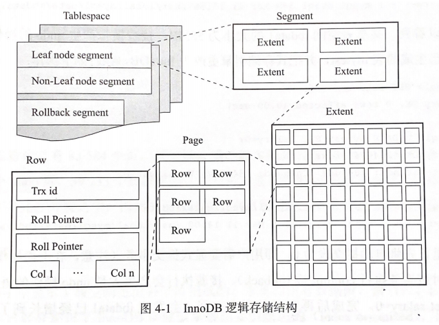
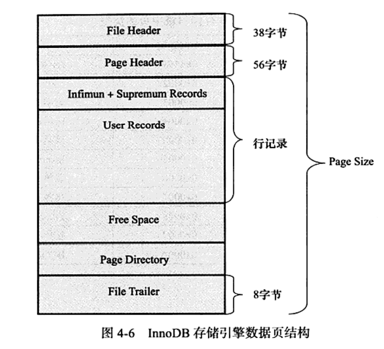
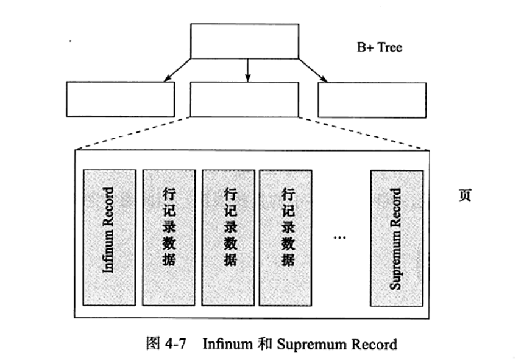

## InnoDB - 表

### 1、索引组织表

* 根据主键顺序组织存放的叫索引组织表；
* InnoDB存储引擎表中，必有主键；创建表时，没有显示定义，会自动选择或创建主键：
  * 表中是否有非空的唯一索引，有则为主键；
  * 否则，自动创建一个6字节大小的指针为主键。
* 查看主键命令：SELECT a,b,c,_rowid FROM z;  abc为列名，__rowid 为查询的主键列

***

### 2、InnoDB 逻辑存储结构

* 所有数据都被逻辑地存放再一个表空间中，表空间由 段(segment)、区(extent)、页(page)组成；
* 

***

***

### 2.1、表空间

* 表空间是InnoDB存储引擎逻辑结构最高层，所有数据都放在表空间中；
* 默认情况下有一个共享的表空间——ibdata1,  所有数据都放在其中；
* 启用 innodb_file_per_table，则每张表内的数据都单独存放到一个表空间，仅是数据、索引和插入缓冲Bitmap页；
* 其他类数据，如回滚信息，插入缓冲索引页，系统事务信息，二次写缓冲等还是在 ibdata1中。

***

### 2.2、段

* 数据段：B+树的叶子节点
* 索引段：B+树的非叶子节点
* 回滚段

***

### 2.3、区

* 区是连续的页构成，任何情况大小为 1M
* 默认页大小为16k，即一个区有64个连续的页
* 引入压缩页后，2、4、8K大小

***

### 2.4、页

* 默认大小16K
* 数据页(B-tree Node)
* undo页(undo Log Page)
* 系统页(System Page)
* 事务数据页(Transaction system Page)
* 插入缓冲位图页(Insert Buffer Free List)
* 插入缓冲空闲列表页(Insert Buffer Free List)
* 未压缩的二进制大对象页(Uncompressed BLOB Page)
* 压缩的二进制大对象页(compressed BLOB Page)

***

### 2.5、行

* InnoDB面向列的，数据按行存放
* 每页存放行记录有限制，最多(16KB/ 2byte)-200 = 7992行
* 200行为预留行数

***

### 2.6、行记录格式

#### 2.6.1 Compact 格式

*  目前使用最多的格式，一个页中行数据越多，性能越高

* 首部是一个非NULL边长字段长度列表，按照列的逆序放置：
  * 若列长度小于255字节，用1字节表示；
  * 大于则用2字节，最大不可超过2字节，因为VARCHAR类型的最大长度限制为65535；

* NULL标志位标识是否有NULL值，NULL只占标志位，不占用其他空间；
* 两个隐藏列：事物ID列(6字节)和回滚指针列(7字节)；

| 1-2字节 | 1字节 | 5字节 |         |         |        |
| :----------: | :-------: | :--------: | :-----: | :-----: | ------ |
| 变长字段长度列表 | NULL标志位 | 记录头信息 | 列1数据 | 列2数据 | ...... |

#### 2.6.2 Redundant 格式

* MYSQL5.0之前的记录存储方式，兼容之前版本的页格式；

#### 2.6.3 行溢出数据

InnoDB会将一条记录种的某些数据存储在真正的数据页之外；

* 并不支持 65535长度的 VARCHAR 类型，因为还有别的开销；
* 实测最大能存放的最大长度为 65532，但数据库会自动将VARCHAR转为TEXT类型；

**重点：**

* VARCHAR(N), N指的是字符的长度；
* 而文档说的最大支持 65535指的是字节；
* 另外，65535指的是所有VARCHAR列的长度总和；
* InnoDB行保存VARCHAR的前768字节，之后偏移量指向行溢出页-BLOB page。

**行溢出：**

* InnoDB 引擎的数据一般都是存放在页类型为 B-tree node中；
* 行溢出时，数据存放在页类型为 Uncompress BLOB页中;
* VARCHAR类型的行数据放到BLOB页的阈值为VARCHAR(8098)。

#### 2.6.4 Compressed和Dynamic行记录格式

* InnoDB 1.0.x版本引入的新的页格式；
* 对于存放在BLOB中的数据采用了完全的行溢出的方式；
* 数据页只存放20个字节的指针，实际的苏剧都存放在Off Page页中。

#### 2.6.5 CHAR 的行结构存储

* 通常理解VARCHAR是存储变长长度的字符类型，CHAR是存储定长长度的字符类型；
* MYSQL 4.1版本开始，CHR(N) N指的是字符的长度，而不是之前的字节长度；
* 所以在不同的字符集下，CHAR类型的内部存储可能不是定长的数据；

***

### 3、InnoDB 数据页结构

**组成结构：**

* File Headers - 文件头：记录页的一些头信息，8个部分组成，38字节；
* Page Headers - 页头：记录数据页的状态信息，14个部分，56字节；
* Infimum 和 Superemum Records：每个数据页有两个虚拟的行记录，用来限定记录的边界，Infimum记录时比该页任何主键值都要小的值，Supremum相反。它们在页创建时生成，不会被删除；
* User Records- 行记录：实际存储行记录的内容
* Free Space - 空闲空间：空闲空间，链表数据结构，一条记录被删除后，该空间会被加入到空闲链表中；
* Page Directory - 页目录：存放了记录的相对位置（页相对位置不是偏移量），有时候这些记录指针被称为Slots（槽）；InnoDB中一个槽可能包含多个记录；

**PS:** **B+树索引本身不能找到具体的一条记录，能找到的只是该记录所在的页，数据库把页载入内存，通过 PageDirectory再进行二叉查找。**

* File Trailer - 文件结尾信息：为了检测页是否已经完整地写入磁盘。

***

### 4、约束

#### 4.1 数据完整性

* 关系型数据库本身能保证存储数据的完整性；
* 约束机制保证数据库中数据完整性；
* 域完整性保证数据每列的值满足特定的条件：
  * 选择合适的数据类型
  * 外键约束
  * 编写触发器
  * DEFAULT约束
* InnoDB引擎本身提供的约束：
  * Primary Key
  * Unique Key
  * Foregin Key
  * Default
  * NOT NULL

#### 4.2 约束的创建和查找

* 创建方式：
  * 表建立时进行约束
  * 利用 ALTER TABLE 命令后创建约束

#### 4.3 约束和索引的区别

* 创建了一个唯一索引就创建了一个唯一约束；
* 约束更是一个逻辑的概念，保证数据的完整性；
* 索引是一个数据结构，既有逻辑上的概念，数据库中还代表物理存储的方式。

#### 4.4 对错误数据的约束

* 某些默认设置下，MYSQL数据库允许非法或不正确的数据插入或更新
  * NOT NULL 插入NULL, MYSQL 会将其改为0再插入
* 设置参数 sql_model的值为STRICT_TRANS_TABLES 可严格约束。

#### 4.5 ENUM 和 SET 约束

* MYSQL 不支持传统的 CHECK约束；
* ENUM 和 SET 可以解决此问题

#### 4.6 触发器于约束

* 触发器的作用是在执行 INSERT、DELETE、UPDATE命令之前或之后自动调用SQL命令或存储过程；
* 创建命令：CREATE TRIGGER
* 一张表最多6个触发器
  * INSERT BEFORE/AFTER
  * UPDATE BEFORE/AFTER
  * DELETE BEFORE/AFTER

***

### 5 、视图（View）

* 定义：
  * 一个命名的虚表
  * 由一个SQL 查询来定义，可以当作表使用
  * 没有实际的物理存储
* 作用：
  * 用做一个抽象装置
  * 程序无需关心基表结构
  * 只需按照视图定义来获取或更新数据
  * 一定程度上作为安全层的作用
* 物化视图：
  * Oracle数据库支持物化视图
  * 即不是虚表，而是基于基表实际存在的实表
  * 用于预先计算并保存多表的链接(join)或聚集(group by)等耗时较多的SQL操作结果

<<<<<<< HEAD
***

### 6、 分区表

#### 6.1 概述

* 分区就是将一个表或索引分解成多个更小、更可管理的部分；
* 分区功能是在表级完成，所以有的引擎支持(MyISAM, InnoDB)有的不支持；
* MySQL支持水平分区(行)，不支持垂直分区(列)；
* 支持局部分区索引(分区包含索引和数据),不支持全局分区(索引单独);
* 查看分区:
  *  SHOW VARIABLES LIKE 'partitioning'
  * SHOW PLUGINS\G
* 分区不一定提高性能，根据实际情况；

#### 6.2 分区类型（PAGE. 152）

* RANGE 分区：行数据基于属于一个给定连续区间的列值被放入分区；
* LIST 分区：类似RANGE, 但LIST分区面向的是离散的值；
* HASH 分区：根据用户自定义表达式的返回值分区；
* KEY 分区：根据MySQL 数据库提供的哈希函数来进行分区；
* COLUMNS 分区: 前四种分区，数据必须为整型(integer)，若不为必须用YEAR(),TO_DAYS(),MONTH()等函数转换；5.5版本开始，支持非整型的COLUMNS分区。

**PS: 若表中存在主键或唯一索引时，分区列必须时唯一索引的一个组成部分。**
=======
>>>>>>> c2432f5b7f59d04d4fc47dbb92b51b7c28b041f6
